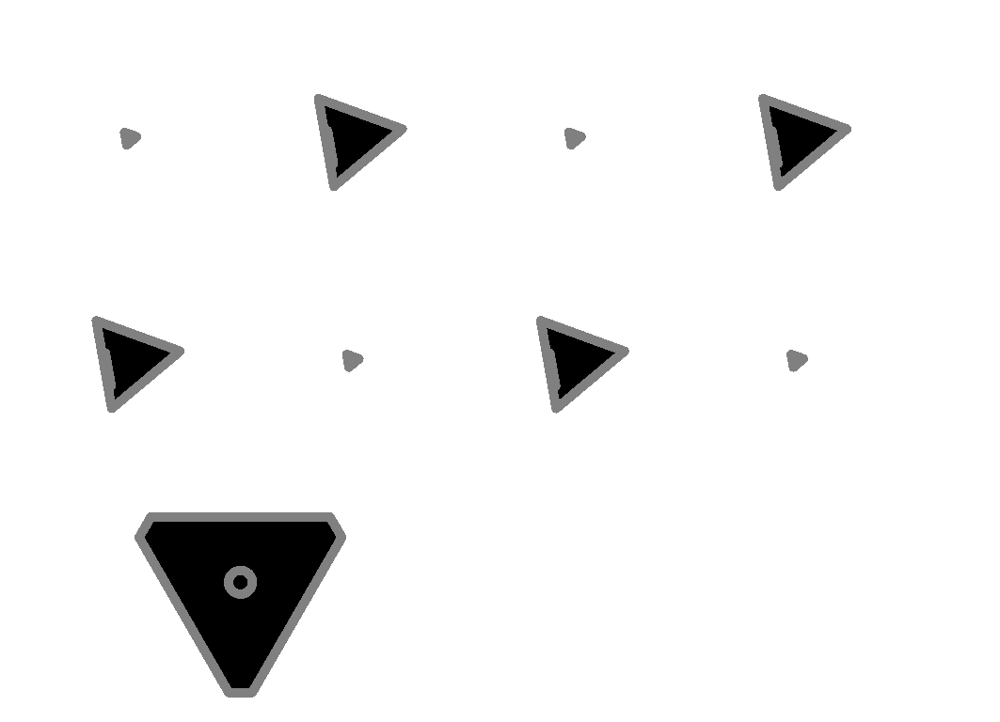
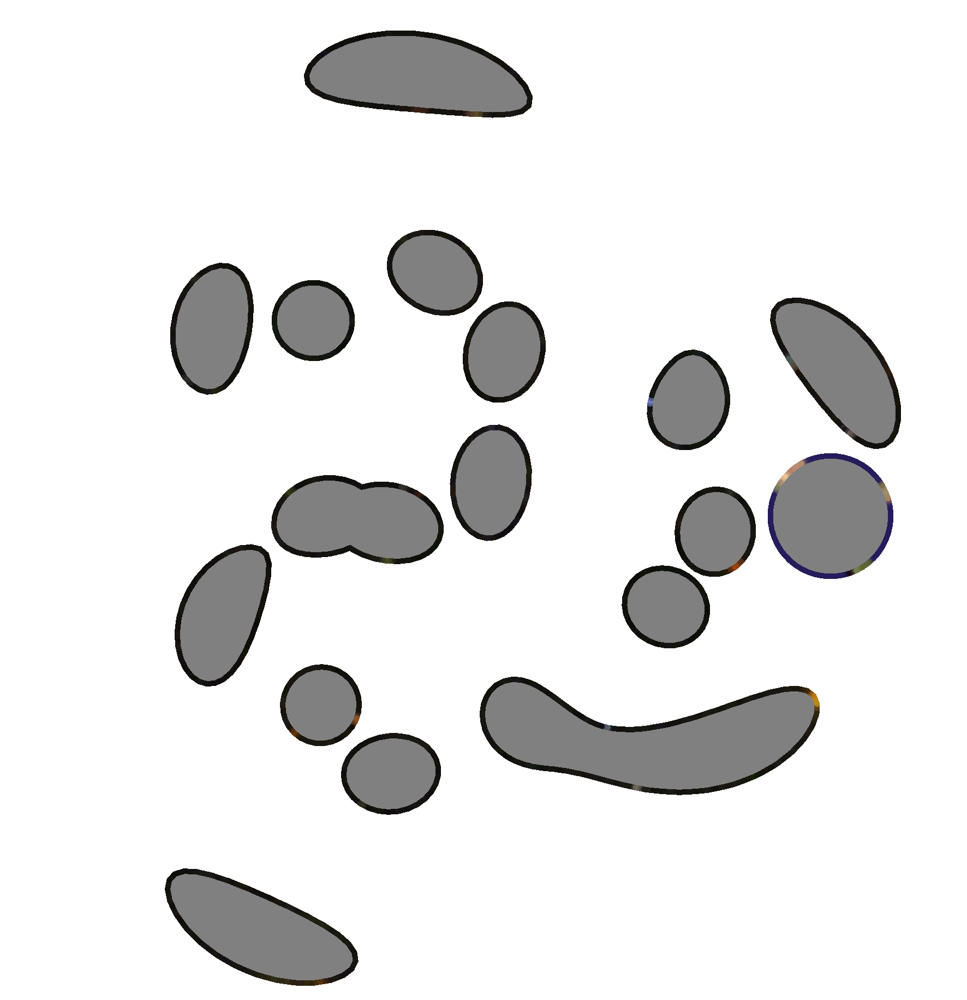
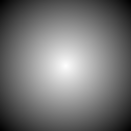

# lib3mf-slicer

A command-line tool for slicing 3MF (3D Manufacturing Format) files into 2D images. This tool is a pretty early stage and will require refinements. Contributions of any kind are more than welcome.

## Overview

`lib3mf-slicer` is a specialized tool that processes 3MF files and generates slice images at specified intervals within a defined printable volume. It supports various 3MF features including:

- Standard mesh geometries
- Materials and surface colors
- Boolean operations
- Beam lattice structures
- **Displacement maps**
- **Slice stacks** (pre-computed slice data) (NEW!)
- Encrypted content (with optional crypto feature)

## Visual Examples

### Multi-Part 3MF with Multiple Gears (cube_gears.3mf)

This example shows slicing of a complex multi-part 3MF file containing multiple gears. The model includes 17 build items with various gear components. When sliced, the tool correctly handles all parts and generates contours for each intersected geometry.

**Generated slice at Z=25mm:**



The slice shows multiple gear cross-sections from different parts of the assembly (1063×768 pixels at 150 DPI). This demonstrates the slicer's ability to:
- Handle multi-part models with multiple build items
- Process objects with complex geometries
- Generate accurate 2D contours from 3D mesh intersections
- Render filled geometry with proper scanline rasterization

### 3MF with Textured Materials (multipletextures.3mf)

This example demonstrates slicing of a 3MF file that contains color texture information. The model includes texture coordinate mappings and multiple texture images.

**Generated slice at Z=45mm:**



This slice illustrates the slicer's capability to (886×915 pixels at 150 DPI):
- Process models with texture coordinate data
- Handle 3MF material extensions
- Generate slices from complex surface geometries
- Render colored borders from texture/material properties with mid-gray fill

### Displacement Mapping (displacement sample)

The slicer now supports the 3MF Displacement Extension, which allows texture-based surface displacement for creating complex surface details. This feature modifies mesh geometry by offsetting vertices along their normal vectors based on grayscale texture values.

**Displacement texture (radial gradient, 256×256 pixels):**



The displacement mapping process:
1. **Texture Loading**: PNG textures are loaded from `/3D/Textures/` in the 3MF archive
2. **UV Sampling**: Each vertex samples the texture using its UV coordinates
3. **Displacement Calculation**: `vertex_position += normal_vector × (offset + height × texture_value × factor)`
4. **Tile Modes**: Supports wrap, mirror, clamp, and none modes for handling UV coordinates outside [0,1]

The sample includes a 10mm box with 1.5mm displacement amplitude using the radial gradient texture shown above. White areas (255) create maximum outward displacement, while black areas (0) produce no displacement, resulting in a "bulge" effect on the box faces.

**Configuration**: The displacement sample uses 150 DPI resolution and 100 μm (0.1 mm) slice thickness, configured to capture displaced surfaces in the printable volume.

See `samples/displacement/README.md` for complete documentation and usage examples.

Both standard examples use a 150 DPI resolution and 100 μm (0.1 mm) slice thickness, producing high-quality PNG images suitable for additive manufacturing processes. Models with color data are rendered with colored borders and mid-gray fill, while plain models use black fill.

## Installation

From the tools/slicer directory:

```bash
cargo build --release
```

The binary will be available at `../../target/release/lib3mf-slicer`

### Optional Features

To enable support for encrypted 3MF files:

```bash
cargo build --release --features crypto
```

## Usage

```bash
lib3mf-slicer <INPUT_FILE> <CONFIG_FILE> [OPTIONS]
```

### Arguments

- `INPUT_FILE`: Path to the 3MF file to slice
- `CONFIG_FILE`: Path to the JSON configuration file

### Options

- `-o, --output <OUTPUT_DIR>`: Output directory for slice images (default: ./slices)
- `-v, --verbose`: Show detailed model information
- `-h, --help`: Print help information
- `-V, --version`: Print version information

### Example

```bash
# Basic usage
lib3mf-slicer model.3mf config.json

# With custom output directory
lib3mf-slicer model.3mf config.json --output my_slices

# With verbose output
lib3mf-slicer model.3mf config.json --verbose
```

## Configuration File Format

The configuration file is a JSON file with the following structure:

```json
{
  "slice_thickness_um": 50,
  "printable_box": {
    "origin": {
      "x": 0.0,
      "y": 0.0,
      "z": 0.0
    },
    "end": {
      "x": 200.0,
      "y": 200.0,
      "z": 200.0
    }
  },
  "resolution": {
    "dpi": 300
  },
  "key_file": null,
  "spec_support": {
    "meshes": true,
    "materials": true,
    "beam_lattice": true,
    "boolean_ops": true,
    "displacement": true,
    "slice_extension": true
  }
}
```

### Configuration Parameters

#### Required Parameters

- **slice_thickness_um** (number): Thickness of each slice layer in micrometers (μm)
  - Must be positive
  - Example: `50` = 0.05 mm layers

- **printable_box** (object): Defines the printable volume
  - **origin** (object): Minimum corner point in millimeters
    - **x**, **y**, **z** (numbers): Coordinates in mm
  - **end** (object): Maximum corner point in millimeters
    - **x**, **y**, **z** (numbers): Coordinates in mm
  - All dimensions must be positive (end > origin)

- **resolution** (object): Output image resolution in DPI (dots per inch)
  - **dpi** (number): Dots per inch for image generation
  - Must be a positive integer
  - Image dimensions are calculated automatically: `width = (box_width_mm / 25.4) * dpi`, `height = (box_height_mm / 25.4) * dpi`
  - Example: `300` DPI for a 200x200mm box = 2362x2362 pixels

#### Optional Parameters

- **key_file** (string or null): Path to public key file for encrypted 3MF files
  - Only used when built with `crypto` feature
  - Default: `null` (no decryption)

- **spec_support** (object or null): Enable/disable specific 3MF features
  - **meshes** (boolean): Support mesh geometries (default: `true`)
  - **materials** (boolean): Support materials (default: `true`)
  - **beam_lattice** (boolean): Support beam lattice structures (default: `true`)
  - **boolean_ops** (boolean): Support boolean operations (default: `true`)
  - **displacement** (boolean): Support displacement maps (default: `true`)
  - **slice_extension** (boolean): Support slice extension (default: `true`)

## Output

The tool generates PNG images for each slice layer, named in the format:

```
slice_00000_z0.000mm.png
slice_00001_z0.050mm.png
slice_00002_z0.100mm.png
...
```

Each image:
- Has a white background
- Shows sliced geometry in black
- Uses the specified resolution
- Covers the defined printable box area

## Examples

### Example 1: Standard Slicing

Create a configuration file `config.json`:

```json
{
  "slice_thickness_um": 50,
  "printable_box": {
    "origin": {"x": 0, "y": 0, "z": 0},
    "end": {"x": 200, "y": 200, "z": 200}
  },
  "resolution": {
    "dpi": 300
  }
}
```

Run the slicer:

```bash
lib3mf-slicer model.3mf config.json
```

### Example 2: High-Resolution Slicing

For higher quality output with finer details:

```json
{
  "slice_thickness_um": 25,
  "printable_box": {
    "origin": {"x": -100, "y": -100, "z": 0},
    "end": {"x": 100, "y": 100, "z": 150}
  },
  "resolution": {
    "dpi": 600
  }
}
```

### Example 3: Selective Feature Support

To disable certain features:

```json
{
  "slice_thickness_um": 50,
  "printable_box": {
    "origin": {"x": 0, "y": 0, "z": 0},
    "end": {"x": 200, "y": 200, "z": 200}
  },
  "resolution": {
    "dpi": 300
  },
  "spec_support": {
    "meshes": true,
    "materials": false,
    "beam_lattice": false,
    "boolean_ops": true,
    "displacement": false,
    "slice_extension": true
  }
}
```

## Technical Details

### Slicing Algorithm

1. **Model Loading**: Parse the 3MF file and extract all geometry
2. **Build Item Processing**: Process objects referenced in build items with their transforms
3. **Layer Calculation**: Compute Z-heights for each layer based on slice thickness and printable box
4. **Object Filtering**: For each layer, determine which objects intersect that Z-height
5. **Mesh Transformation**: Apply affine transforms from build items to mesh vertices
6. **Mesh Intersection**: For each object at current Z, intersect meshes with the Z-plane
7. **Contour Assembly**: Collect intersection segments and assemble closed contours
8. **Rasterization**: Triangulate polygons and render to PNG with calculated resolution (DPI-based)

### Coordinate System

- **Input coordinates**: Millimeters (mm)
- **Slice thickness**: Micrometers (μm)
- **Output images**: Pixels (calculated from DPI and printable box size in mm)

The printable box defines the world-space region to slice. Image dimensions are automatically calculated based on the printable box size and DPI resolution: 
- Width (pixels) = (box_width_mm / 25.4) × DPI
- Height (pixels) = (box_height_mm / 25.4) × DPI

Objects are positioned according to their build item transforms, and only objects that intersect with the current Z layer are processed for that layer.

## Sample Configurations

The `samples/` directory contains example configurations demonstrating various slicing scenarios:

### 1. Displacement Map - Textured Surface Displacement (NEW!)

Location: `samples/displacement/`

Demonstrates slicing of objects with displacement mapping applied:
- Radial gradient displacement texture (256×256 pixels)
- 1.5mm displacement amplitude  
- Proper normal vector handling
- All tile modes supported (wrap/mirror/clamp/none)

**Note**: Full end-to-end demonstration requires DisplacementMesh writer implementation in core library. The slicer correctly loads textures and applies displacement.

See `samples/displacement/README.md` for detailed information.

### 2. Pyramid - Beam Lattice Structure

Location: `samples/pyramid/`

Demonstrates slicing of beam lattice structures with:
- Cylindrical beams with circular cross-sections
- Tapered beams with interpolated radii
- Ball joints at vertices
- 58 contours at base (Z=0), 6 at apex (Z=100mm)

See `samples/pyramid/README.md` for detailed information.

### 2. Box with Slice Stack - Slice Extension

Location: `samples/box_sliced/`

Demonstrates the slicer's ability to work with pre-computed slice data from the Slice extension:
- Object references a slice stack instead of computing slices from mesh
- 378 pre-computed slices at 0.08mm intervals
- Build item transforms correctly applied to 2D slice vertices
- World-space to object-space Z coordinate conversion

Key features demonstrated:
- **Slice stack detection**: Automatically uses pre-computed slices when available
- **Transform handling**: Applies affine transforms to slice vertices
- **Z-coordinate mapping**: Converts between world and object coordinate systems
- **Efficient slicing**: No mesh intersection computation needed

See `samples/box_sliced/README.md` for detailed information about slice stack processing.

### 3. Cube Gears - Standard Mesh Geometry

Location: `samples/cube_gears/`

Standard mesh slicing example.

### 4. Multiple Textures - Material Support

Location: `samples/multipletextures/`

Demonstrates material and texture handling.

To run any sample:

```bash
cargo build --release
../../target/release/lib3mf-slicer \
    samples/<sample_name>/<model>.3mf \
    samples/<sample_name>/config.json \
    -o samples/<sample_name>/output
```

## Dependencies

- **lib3mf**: 3MF file parsing and mesh operations
- **clap**: Command-line argument parsing
- **serde/serde_json**: JSON configuration parsing
- **image**: PNG image generation
- **earcutr**: Polygon triangulation
- **thiserror**: Error handling

## License

MIT License - See LICENSE file for details

## Contributing

Contributions are welcome! Please see the main repository's CONTRIBUTING.md for guidelines.

## Related Tools

- **lib3mf-viewer**: Interactive 3D viewer for 3MF files
